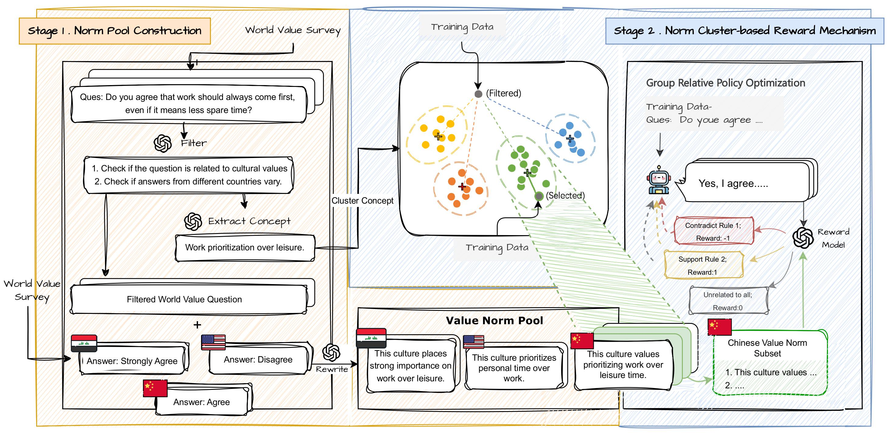

# CultureRL

This is the official code repository for our AAAI 2026 paper:

> **"CultureRL: Internalizing Cultural Principles in Large Language Models via Norm-Driven Reinforcement Learning"**

## 🌟 Overview



Ensuring that large language models (LLMs) behave consistently with diverse cultural norms is essential, yet collecting annotated data for every culture remains costly and infeasible—especially in low-resource regions.

We introduce **CultureRL (Culture-norm-driven Reinforcement Learning)**, an efficient framework that achieves cultural alignment **without requiring large-scale labeled data**. Instead, CultureRL relies on a small set of explicit cultural principles as alignment anchors to guide model behavior through reinforcement learning.  

- 🧩 **Norm Pool Construction (NPC)** clusters any available cultural norms—such as those derived from the *World Values Survey* or other sociocultural datasets—into structured semantic groups. These clusters serve as retrievable anchors that represent cultural principles at different abstraction levels.  
- 🎯 **Norm Cluster-based Reward Mechanism (NCRM)** evaluates model outputs based on their conformity to the retrieved norm clusters, providing culture-aware feedback signals that guide policy optimization.  

By internalizing cultural principles rather than imitating annotated examples, **CultureRL** enables scalable, data-efficient, and generalizable cultural adaptation across both high- and low-resource settings.

## 🛠️ Installation

The installation process generally follows the setup procedure of **[Open-R1](https://github.com/huggingface/open-r1/tree/main)**.

We recommend using a virtual environment:

```bash
pip install vllm==0.8.5.post1
pip install setuptools && pip install flash-attn --no-build-isolation

cd open-r1
pip install -e ".[dev]"
```

## 📃 Data

In our paper, we use 62 World Value Survey questions as norm data to construct the Norm Pool. However, the framework is flexible — you can also use any other culturally grounded datasets or custom-designed value statements as the foundational norm data and then:

```bash
python dataprocess/cluster_embedding.py path/to/your/NormData cluster_num
```

## 🚀 Run

### 1. Run training

```bash
bash open-r1/sbatch_script/country_value_grpo_full.sh
```

### 2. Run evaluation

```bash
bash open-r1/eval/country.sh /path/to/your/model
```

## 📌 Citation
If you find this repository useful, please cite our paper:
```
@article{
  title={CultureRL: Internalizing Cultural Principles in Large Language Models via Norm-Driven Reinforcement Learning},
  volume={40},
  url={https://ojs.aaai.org/index.php/AAAI/article/view/41150},
  DOI={10.1609/aaai.v40i44.41150},
  number={44},
  journal={Proceedings of the AAAI Conference on Artificial Intelligence},
  author={Zhao, Weixiang and Li, Haozhen and Zhao, Yanyan and Liu, Haixiao and Li, Biye and Liu, Ting and Qin, Bing},
  year={2026},
  month={Mar.},
  pages={38120-38128}
}
```
